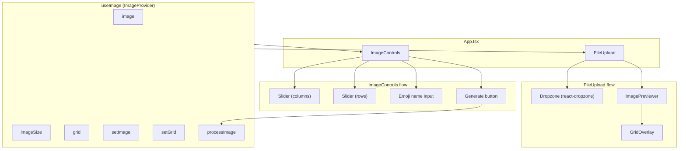
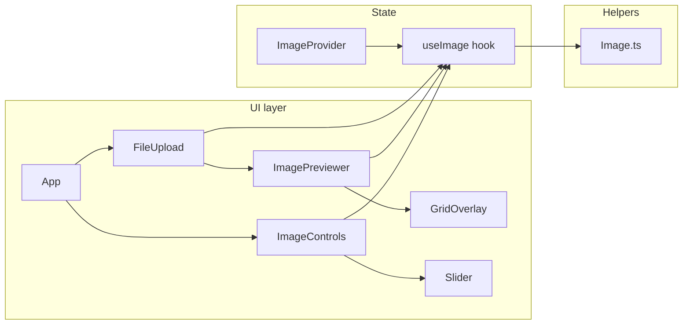

# Image to Cropped Emoji

A web app that lets you upload any image and split it into a grid of squared crops. You choose how many columns and rows you want; the app generates a ZIP containing one image per grid cell.

## What it does

- **Upload an image** — Use any image you want as the source.
- **Set the grid** — Enter the number of columns and rows. The image is divided into that grid.
- **Squared crops** — Each crop is always a square (same width and height).
- **ZIP download** — All cropped tiles are bundled into a single ZIP file for download.
- **Grid-only output** — Only areas that fit completely inside the grid are included. Any part of the image that falls outside the grid overlay is not included in the crops.

---

## Technical documentation

### Features

| Feature | Description | Implementation |
|--------|-------------|----------------|
| **Image upload** | Accept a single image via drag-and-drop or file picker. Supported formats: PNG, JPEG, GIF, WebP. | `FileUpload` component using `react-dropzone`; accepted files passed into `useImage` context. |
| **Grid configuration** | User-defined number of columns and rows (1–10 each) to split the image. | `ImageControls` + `Slider`; grid state held in `useImage` context (`grid.columns`, `grid.rows`). |
| **Live grid overlay** | Visual overlay showing the current grid on the uploaded image before generation. | `ImagePreviewer` renders the image and `GridOverlay`; overlay uses a CSS grid matching `columns` × `rows`. |
| **Squared crops** | Each tile is cropped to uniform dimensions (width/columns × height/rows); cells are kept square when the grid is applied. | `cropImage()` in `helpers/Image.ts` uses canvas to extract each cell with consistent dimensions. |
| **Grid-only output** | Only regions that lie entirely within the grid are exported; no partial cells. | `cropImage()` iterates only over full grid cells (`rows` × `columns`); remainder of the image is not included. |
| **ZIP download** | All cropped images are packaged into a single ZIP and triggered for download. | `zipFiles()` (JSZip) in `helpers/Image.ts`; `downloadBlob()` triggers the browser download. |
| **Replace image** | User can clear the current image and upload a different one. | `ImagePreviewer` “Replace” button calls `setImage(null)`, which switches the UI back to the dropzone. |

### Architecture

#### High-level flow


#### Component hierarchy and data flow



#### Module layout



- **UI layer**: React components for layout, upload, preview, overlay, and controls.
- **State**: `ImageProvider` (React context) holds the current image, dimensions, grid settings, and exposes `processImage` for the generate action.
- **Helpers**: `Image.ts` provides `getImageSize`, `cropImage`, `zipFiles`, and `downloadBlob` (canvas + JSZip, no server).

---

## Getting started

```bash
pnpm install
pnpm dev
```

Built with React, TypeScript, and Vite.
